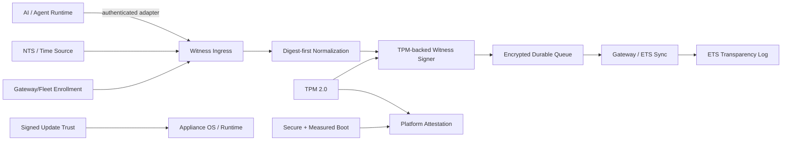
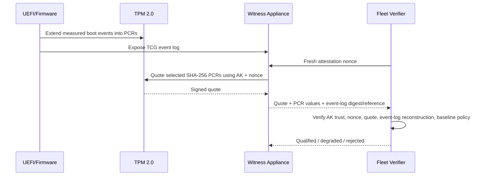

# ETS AI Witness Physical Appliance Architecture

Status: pilot architecture candidate  
Profile: `ets.ai-witness.appliance.pilot.v1`

## 1. Architecture objective

The physical AI Witness appliance converts AI/runtime observations into independently verifiable ETS evidence while keeping the observation, signing, storage, update, and management trust boundaries separate.

## 2. Trust zones

### Observation zone

Receives only approved AI/runtime evidence from authenticated adapters. Payload-declared identity is never sufficient for tenant/workspace authorization.

### Evidence-processing zone

Canonicalizes the bounded Witness event, validates the digest-only privacy contract, establishes sequence continuity, and prepares the signed record payload.

### Hardware trust zone

Contains TPM-backed keys and platform measurements. Production private signing/sealing keys do not leave this zone as application-visible bytes.

### Durable storage zone

Stores encrypted signed Witness records awaiting upstream acknowledgement. The queue uses authenticated encryption so modification is detected before replay.

### Management/update zone

Handles enrollment, configuration, diagnostic policy, update metadata, and recovery. Management authority does not imply authority to rewrite signed evidence history.

### Upstream zone

Synchronizes immutable Witness records and appliance lifecycle evidence to ETS through Gateway or directly to an approved ETS endpoint.

## 3. Key hierarchy and purpose separation

The pilot design requires separate roles for:

- TPM endorsement/platform identity;
- attestation key used for PCR quote evidence;
- Witness evidence-signing key;
- queue sealing/derivation key;
- TLS/device transport key;
- Gateway/fleet enrollment trust key;
- appliance update root/targets keys.

No role should reuse a private key merely because the same TPM can hold it.

## 4. Boot and attestation flow

A cryptographically valid quote is necessary but not sufficient. The verifier must also decide whether the measured state satisfies the approved platform policy.

## 5. Observation and durable capture flow

1. Adapter authenticates to the Witness.
2. Witness resolves enrolled tenant/workspace and source identity server-side.
3. Adapter submits bounded metadata and content digests; raw content is rejected by the base profile.
4. Witness validates event type, sequencing, model/tool/human context, and size ceiling.
5. TPM-backed signer signs the purpose-separated Witness record payload.
6. Signed record is encrypted and committed to the durable queue.
7. Local capture acknowledgement occurs only after the durable transaction succeeds.
8. Sync worker transmits the immutable record to Gateway/ETS.
9. Upstream acknowledgement is bound to the record digest.
10. Queue entry is removed only after the configured acknowledgement policy succeeds.

## 6. Durable queue architecture

The software reference uses SQLite with WAL and `synchronous=FULL` plus AES-256-GCM encryption. A purpose-separated queue key is derived with HKDF-SHA-256.

For the physical appliance, the root key material is expected to be TPM-sealed. The application may receive only a short-lived unsealed working key or use a hardware-backed provider abstraction; persistent plaintext key files are outside the pilot profile.

The queue intentionally stores only the immutable record digest in plaintext for idempotency/indexing. The complete signed Witness record is encrypted.

## 7. Signed update architecture

The initial implementation provides a small signed update-manifest contract containing:

- product identity;
- monotonic release sequence;
- human-readable release version;
- target SHA-256 digest;
- target byte size;
- metadata version;
- expiration time;
- signing key identity;
- Ed25519 signature.

The appliance rejects expired or rollback manifests before installation and re-verifies downloaded target digest/size before activation. The production distribution service should evolve to TUF role separation and threshold signing.

## 8. Clock architecture

Wall clock is evidence, not an ordering primitive. The appliance:

- records source-provided occurrence time separately from Witness observation time;
- tracks time source, protocol, offset estimate, uncertainty, and last synchronization;
- prefers NTS-authenticated NTP where supported;
- uses monotonic clocks for retry, backoff, leases, and duration calculations;
- degrades qualification state when clock quality becomes unknown or exceeds the configured uncertainty ceiling.

## 9. Gateway/fleet enrollment

Enrollment is a signed binding between:

- tenant;
- workspace;
- fleet;
- Gateway;
- Witness identity;
- device signing-key fingerprint;
- freshness nonce;
- issuance/expiration window;
- enrollment signing key.

The runtime cannot override these server-owned scope bindings with payload fields.

## 10. Runtime adapter boundary

Adapters may observe hosted model APIs, local inference servers, orchestration frameworks, tool brokers, or agent runtimes. Each adapter must provide authenticated peer identity and an explicit adapter version.

The adapter is responsible for translating provider-specific telemetry into the base Witness event contract. It does not implement ETS hashing/Merkle semantics and it does not receive authority to alter already signed Witness history.

## 11. Failure states

The appliance exposes at least:

- `healthy`: required controls available and current;
- `degraded`: capture can continue but a non-critical assurance input is impaired;
- `unqualified`: a required pilot invariant is false;
- `unknown`: evidence is insufficient to establish state.

Examples requiring `unqualified` or fail-closed behavior include exportable production signing keys, invalid required enrollment, invalid queue key/ciphertext, invalid update authorization, or missing mandatory measured-boot evidence.

## 12. Physical pilot deployment target

Reference capability target:

- x86-64;
- 32 GiB RAM target, 16 GiB minimum;
- 1 TB high-endurance NVMe minimum;
- TPM 2.0;
- UEFI Secure Boot;
- measured boot with SHA-256 PCR bank/event log;
- dual network interfaces or equivalent isolated VLANs;
- watchdog/RTC preferred;
- independently recoverable boot/update path.

This is a capability profile, not certification of any specific vendor platform.
