# ETS AI Witness Architecture

## Objective

AI Witness sits adjacent to AI workloads and converts observable inference/agent lifecycle events into cryptographically attested, privacy-minimized ETS evidence.

```mermaid
flowchart LR
  App[AI application / agent] --> Adapter[Witness adapter]
  Adapter --> Min[Classification + minimization]
  Min --> Record[Strict AI Witness event]
  Record --> Chain[Per-session hash chain]
  Chain --> Sign[Witness signer]
  Sign --> Project[ETS EvidenceEvent projection]
  Project --> Core[ETS Core append/proof pipeline]
  Core --> Verify[Online/offline verifier]
```

## Capture points

1. Session start/end.
2. Model request and model response.
3. RAG/retrieval inputs.
4. Proposed/authorized/denied/executed tool calls.
5. Human approval/denial/modification.
6. External action result.

Adapters may be native SDK middleware, OpenTelemetry-derived ingestion, reverse-proxy hooks, agent-runtime callbacks, or provider-specific connectors. Capture must occur before any raw-content retention decision; the v1 normative record receives digests rather than raw content.

## Trust zones

- **AI workload zone:** source of observations; not inherently trusted to report complete or truthful metadata.
- **Witness processing zone:** validates/minimizes observations and constructs the signed session chain.
- **Signer boundary:** software Ed25519 for development; hardware-backed non-exportable key required for higher-assurance appliance profiles.
- **ETS Core boundary:** stable canonical append/proof semantics; AI Witness does not reimplement Merkle/proof rules.
- **Verifier/auditor zone:** independently checks ETS proof material and, where available, witness signatures/chains.

## Session chain

For event `n`, the signed payload contains the entire strict AI Witness event plus `previous_record_digest`. The first event uses `null`. Sequence numbers begin at zero and must be contiguous. This detects supplied-record deletion/reordering/substitution within the observed chain, but it cannot prove that an unobserved source event never occurred.

## Privacy model

The base profile stores only SHA-256 digests for content-bearing material. Identifiers such as workload/model/policy/tool names remain metadata and must still be governed by tenant privacy policy. Any future opt-in raw content profile requires separate encryption, access control, retention, jurisdiction, deletion, breach-response, and redaction design; it must not silently widen v1.

## OpenTelemetry alignment

OpenTelemetry GenAI signals can be an input adapter because their current semantic conventions cover provider/model, input/output, retrieval, and trace context. AI Witness intentionally does not copy `gen_ai.input.messages`, `gen_ai.output.messages`, retrieval query text, or system instructions into immutable records. Adapters hash policy-approved canonical representations and retain only bounded digest metadata.

## Deployment modes

- **Library/sidecar:** closest to the AI runtime and best for complete contextual capture, but shares more fate with the workload.
- **Gateway service:** centralized observation across several workloads; simpler operations, potentially less visibility into internal agent state.
- **Physical appliance:** independent signer/storage and stronger tamper boundary; best when network/provider hooks expose enough context.

The recommended product path is library/sidecar plus appliance-backed signer/queue, with Gateway integration for centralized transport and fleet management.
