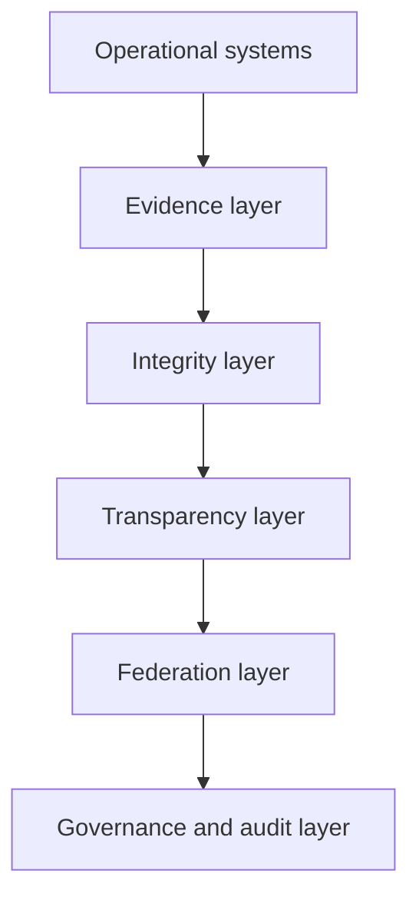
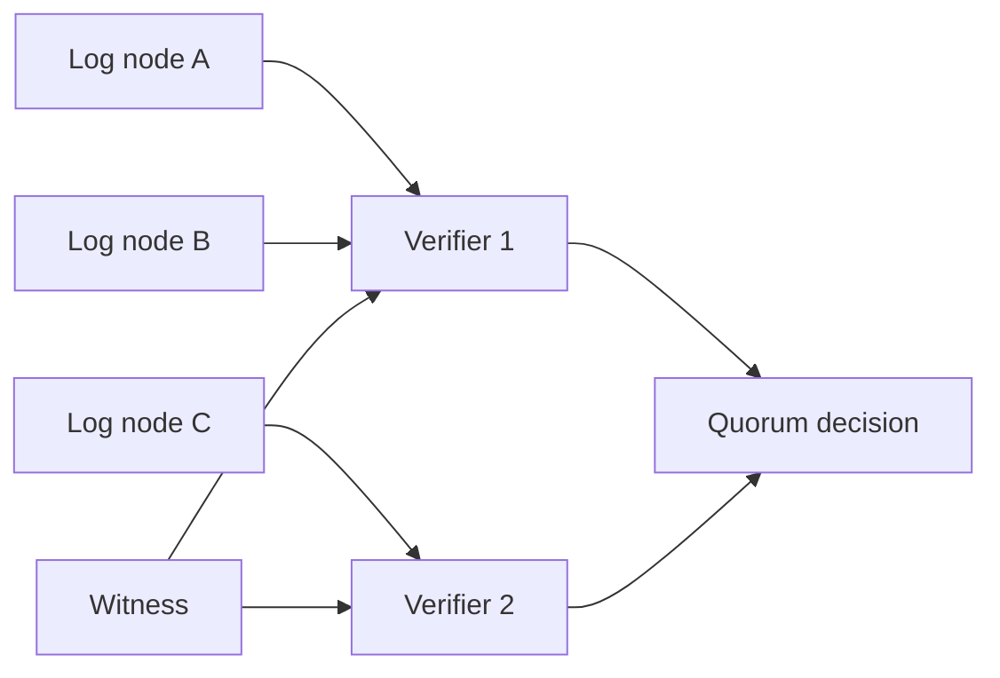
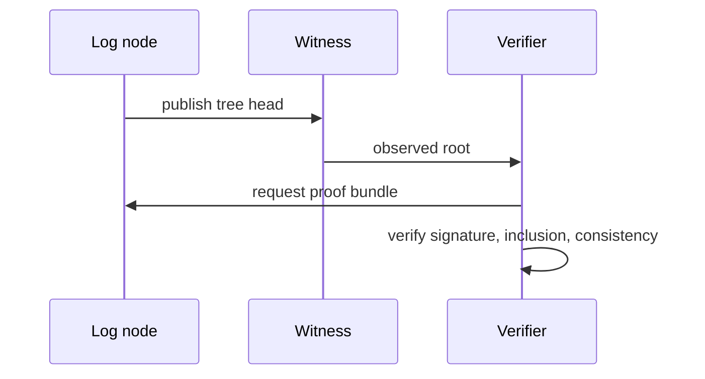
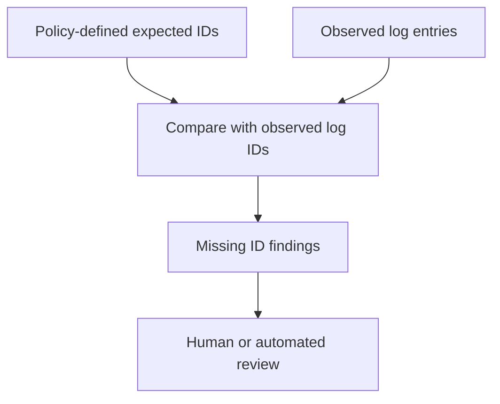
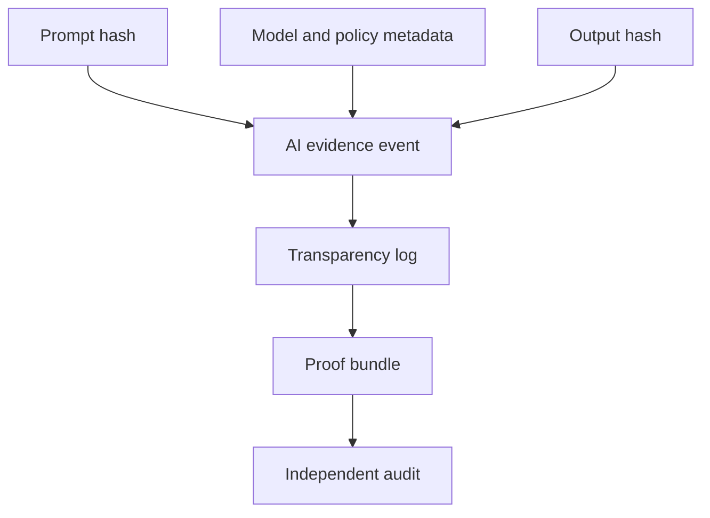
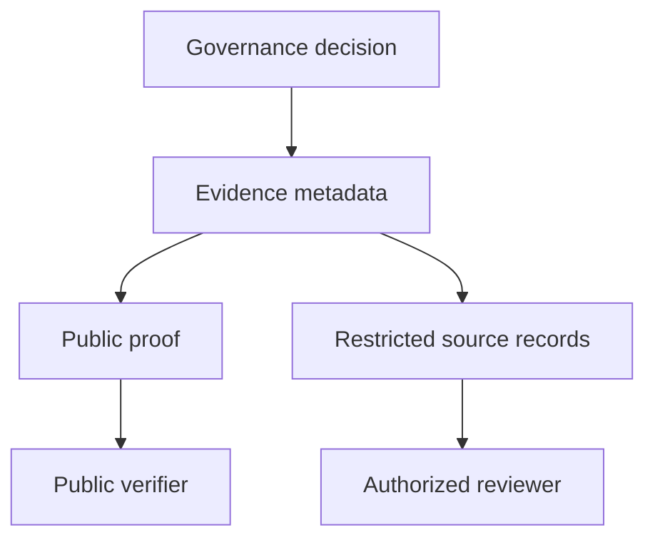

# ETS Interconnected Systems Architecture Guide

This guide describes ETS as an evidence verification fabric. It aligns with
the current reference implementation and marks future production capabilities
explicitly.

## Layered Architecture

## Evidence Layer

Responsibilities:

- validate `EvidenceEvent` objects;
- canonicalize event metadata deterministically;
- separate raw content from hashes and metadata;
- preserve tenant and workspace identifiers for scoped verification.

## Integrity Layer

Responsibilities:

- compute evidence, event, and leaf hashes;
- build Merkle inclusion proofs;
- verify simplified consistency proofs;
- sign tree heads when an Ed25519 key is configured;
- reject unsupported or malformed proof material deterministically.

## Transparency Layer

Responsibilities:

- append records in monotonic log index order;
- publish tree heads and roots;
- generate proof bundles;
- support in-memory and SQLite reference storage;
- avoid storing raw evidence bytes.

## Federation Layer

Responsibilities:

- compare roots observed from multiple nodes;
- detect forks when nodes publish conflicting roots for the same logical view;
- combine verifier votes by quorum policy;
- assess verifier observations through `POST /api/v1/federation/assess`;
- allow witness nodes to record observed tree heads;
- document which nodes and witnesses are trusted for each experiment.

## Root Gossip Flow

## Omission Detection Workflow

Omission detection is relative to an expected event set. ETS can report that an
expected event ID is absent from an observed log. ETS cannot infer that a
real-world event occurred unless an external policy or observer supplied that
expectation.

## AI Accountability Workflow

ETS supports reconstruction of recorded AI evidence chains. It does not prove
model fairness, intent, explanation correctness, or absence of unrecorded
inference events.

## Governance Verification Workflow

Governance escalation is modeled in `ets.governance.escalation`. Technical
signals such as invalid proofs, fork suspicion, omission suspicion, override
requests, and legal holds are classified for human review. ETS does not decide
legal truth or organizational authority.

## Deployment Patterns

- Local developer mode: in-memory store, unsigned tree heads, local warnings.
- Local durable mode: SQLite store, optional Ed25519 tree-head signing.
- Federation lab mode: multiple log/verifier/witness containers.
- Hosted future mode: production OIDC/JWKS auth, managed key rotation,
  operational monitoring, and public release review.

## Trust Boundaries

ETS verifiers trust cryptographic validation logic and configured public keys.
They do not automatically trust a log operator, API transport, UI display, or
external completeness claim. Hosted deployments must define identity,
authorization, retention, key custody, witness policy, and incident response.

## Reference Implementation Mapping

- Evidence and integrity contracts: `ets.core.models`, `ets.core.merkle`,
  `ets.core.proofs`, and `ets.core.signing`.
- Transparency APIs: `ets.api.app` event, proof, bundle, head, and metrics
  routes.
- Federation assessment: `ets.core.federation` and
  `/api/v1/federation/assess`.
- Omission and fork experiments: `ets.experiments.omission_detection` and
  `ets.experiments.fork_simulation`.

The federation assessment is intentionally conservative: it reports a quorum
root only for exact tree-head agreement, and it rejects acceptance when a
same-log, same-size conflicting root is present. This supports reproducible
laboratory experiments without claiming production consensus.

Asynchronous network behavior is explored through bounded seeded experiments
for message queues, delay, and packet loss. These experiments are useful for
measuring convergence under stated assumptions, but they are not partial
synchrony proofs or BFT correctness proofs.

Liveness is modeled as a fairness-scoped research property: replay eventuality,
partition healing, witness propagation completion, and stale-state recovery are
only claimed under explicit weak-fairness and bounded-adversarial-pressure
assumptions. Traceability is maintained in
`docs/research/FORMAL_TRACEABILITY_MATRIX.md`.
