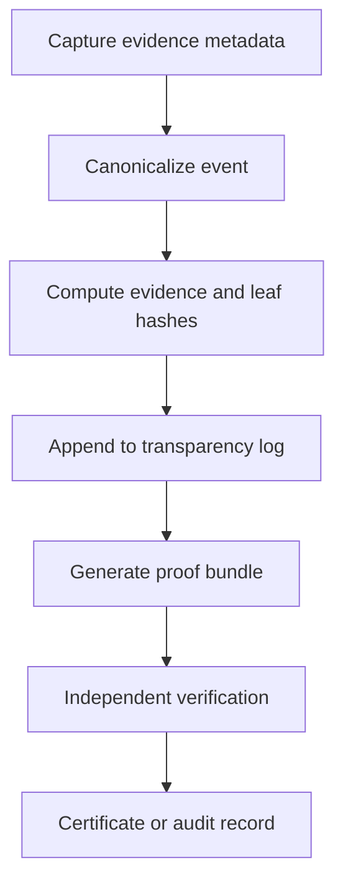
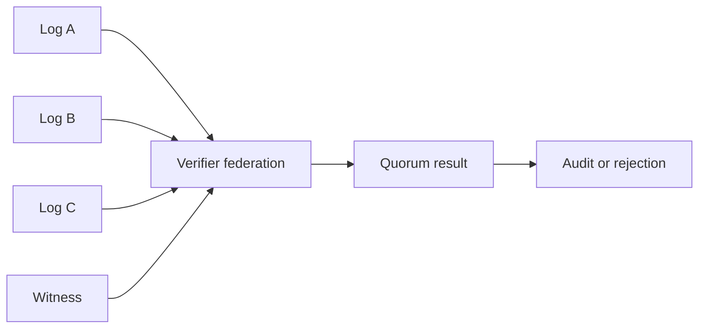

# ETS Invention Disclosure

This document is a technical preparation artifact for patent counsel review. It
is not legal advice and is not a patent filing.

## Protocol Overview

ETS is an evidence transparency protocol that records metadata and content
hashes as canonical evidence events, appends those events to transparency logs,
publishes Merkle proofs and tree heads, and enables independent verifiers to
check evidence inclusion, consistency, signatures, and quorum decisions.

## Evidence Lifecycle

## Technical Novelty Candidates

The novelty candidates are integration and workflow candidates only. They must
be reviewed against prior art before any filing decision.

- a generalized evidence lifecycle that separates raw sensitive content from
  public proof material;
- verifier federation semantics for comparing log roots and quorum votes;
- omission-suspicion workflows that compare policy-defined expected event sets
  against observed transparency logs;
- AI accountability evidence chains using hashes of prompts, outputs, model
  metadata, and policy context;
- selective disclosure workflows where public proof verification does not
  require publication of restricted source records.

## Verifier Federation Model

## Omission Detection Concept

ETS does not prove universal completeness. It can produce omission findings
when an external expected-event policy identifies event IDs that are absent from
an observed log.

## AI Accountability Concept

AI systems can emit evidence events for inference inputs, model configuration,
policy decisions, human review, and deployment actions. ETS verifies the
recorded chain and its proof material. It does not prove semantic correctness
of the AI output.

## Disclosure Timing Notes

Before a public release tag, counsel should review:

- this disclosure;
- `docs/ip/PRIOR_ART_ANALYSIS.md`;
- `docs/ip/CANDIDATE_CLAIMS.md`;
- public README and RFC language;
- benchmark and paper abstracts;
- Apache 2.0 or alternative license implications.
