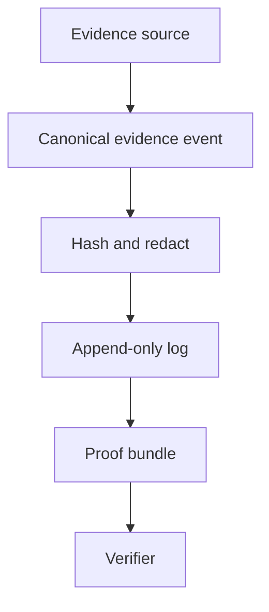
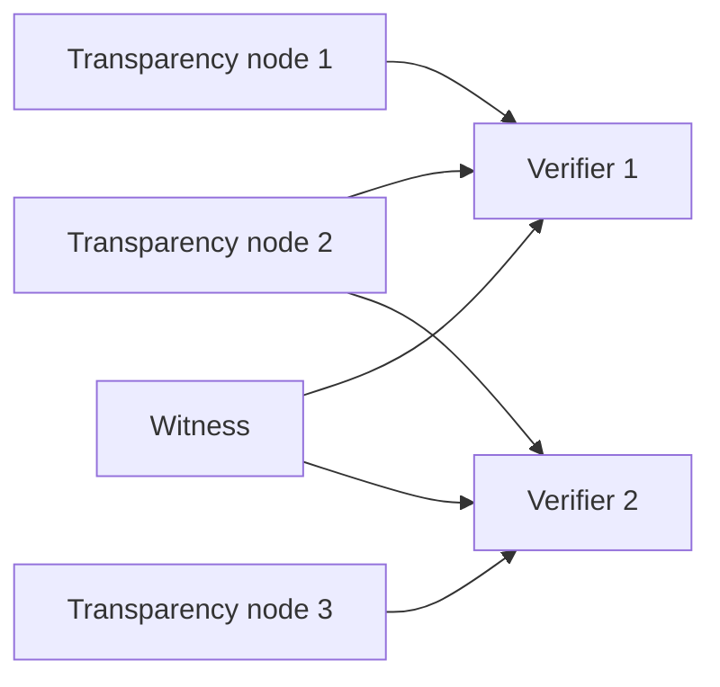
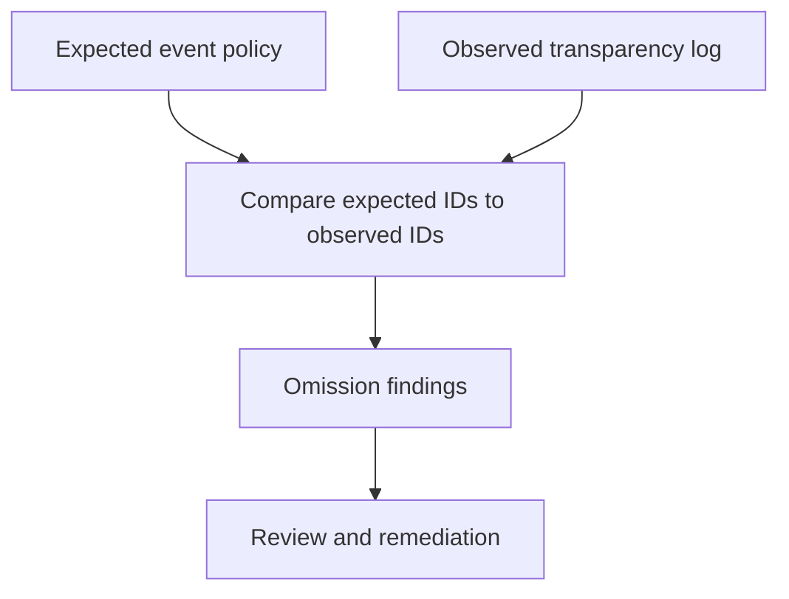
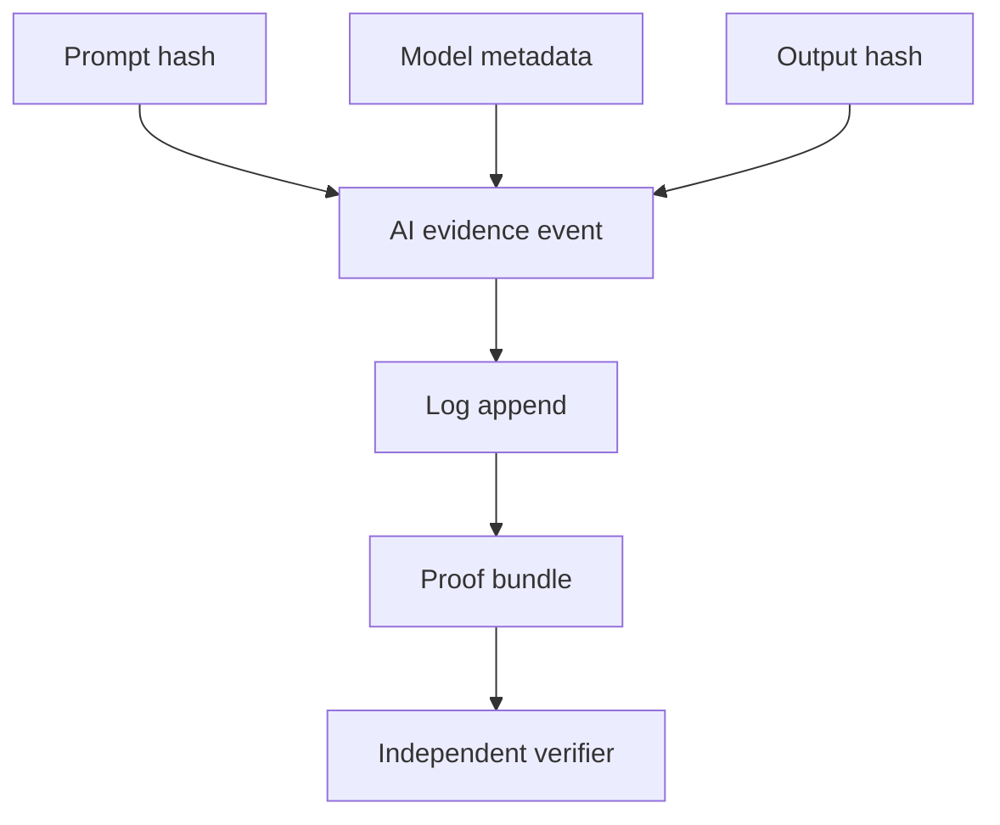
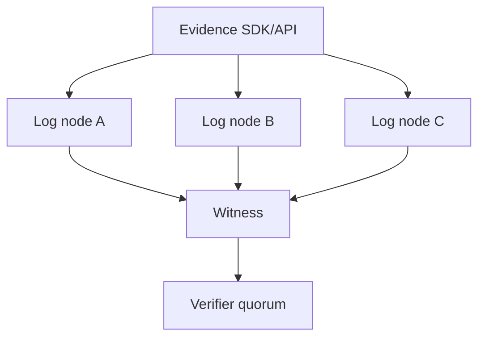
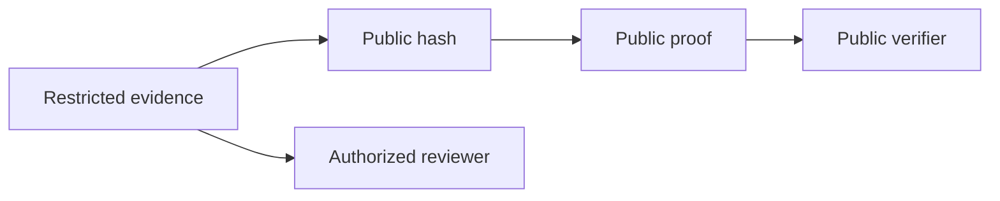

# ETS Patent Preparation Diagrams

These diagrams are technical review aids for patent counsel. They are not legal advice and
are not filed patent figures.

## Evidence Lifecycle

## Verifier Federation Topology

## Omission Suspicion Workflow

## AI Accountability Evidence Chain

## Multi-Node Transparency Architecture

## Selective Disclosure Verification

