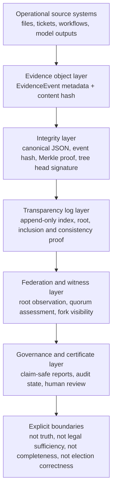

# Paper 1 Extended Abstract: Bounded Semantics for Verifiable Digital Evidence

## Status

- Sprint artifact: Paper Candidate 1 extended abstract.
- Review state: Requires Human Review; advisory only until approved by authorized reviewers.
- Trust label: Real Analysis.
- Risk level: Low for research planning; not a production assurance claim.
- Confidence: Medium, based on current repository artifacts and passing local tests.
- Trace ID: `ets-paper1-extended-abstract-2026-07-18`.
- Evidence IDs: `ETS-P1-EV-001` through `ETS-P1-EV-008` in the evidence table below.

## Working Title

Evidence Transparency Systems: Bounded Semantics for Verifiable Digital Evidence

## Extended Abstract

Digital evidence workflows routinely conflate four distinct questions: whether an artifact was recorded, whether it was preserved without mutation, whether it was observed by an authorized process, and whether the real-world claims inside the artifact are true. This conflation creates brittle audit and governance practices because cryptographic integrity is often interpreted as semantic truth, and missing records are interpreted without an explicit expected-event policy. Evidence Transparency Systems (ETS) propose a bounded alternative: a protocol and reference implementation for recording submitted evidence events as canonical, hash-bound, append-only, independently verifiable artifacts while preserving explicit non-claims about truth, legal sufficiency, and completeness.

ETS contributes a layered architecture for verifiable digital evidence. The evidence object layer defines structured event metadata and content hashes. The integrity layer defines deterministic canonicalization, event hashing, Merkle inclusion proofs, consistency verification, and optional signed tree heads. The transparency layer defines append-only log behavior with in-memory and SQLite reference storage. The federation and witness layer compares observed tree heads and exposes disagreement or fork suspicion without claiming Byzantine consensus. The governance layer packages proof material into verification certificates that state what was verified, what was not verified, confidence, risk, and review boundaries.

The reference implementation demonstrates the architecture through Python APIs, a FastAPI local service, verifier CLI commands, SDK helpers, certificate generation, formal models, and reproducibility artifacts. Local tests validate deterministic hashing, event contracts, append-only behavior, inclusion proofs, consistency verification, tenant/workspace scoping, signed tree-head verification, certificate claim safety, and release-readiness controls. Formal artifacts provide bounded TLA+ and Alloy coverage for append-only behavior, omission suspicion under an expected-event policy, asynchronous transport, fork visibility, and fairness-scoped liveness. These models intentionally stop short of universal completeness, legal proof, production trust-service readiness, and Internet-scale adversarial liveness.

The paper's central claim is therefore narrow: ETS can represent submitted digital evidence as independently verifiable artifacts with explicit proof boundaries. It does not claim that ETS proves real-world truth, proves all expected events were captured, certifies legal sufficiency, proves election correctness, or replaces human governance review. This discipline is the contribution: ETS separates preservation from interpretation, visibility from completeness, confidence from authority, and proof material from policy judgment.

## Figure 1: ETS Layered Architecture

## Formal and Implementation Evidence Table

| Evidence ID | Claim Supported | Primary Artifacts | Verification Command | Claim Boundary |
|---|---|---|---|---|
| `ETS-P1-EV-001` | Evidence events have deterministic metadata and content-hash contracts. | `ets/core/models.py`, `ets/core/canonical_json.py`, `ets/spec/protocol.md` | `python -m pytest tests/unit/test_evidence_event.py tests/unit/test_canonical_json.py tests/spec/test_vectors.py` | Does not prove raw evidence authenticity or semantic truth. |
| `ETS-P1-EV-002` | The local log preserves append-only ordering within the ETS storage boundary. | `ets/core/log.py`, `formal/tla/ETSLog.tla`, `formal/alloy/ETSCausalModel.als` | `python -m pytest tests/unit/test_append_log.py` | Does not prove every expected real-world event was submitted. |
| `ETS-P1-EV-003` | Inclusion proof verification works for supplied proof material. | `ets/core/proofs.py`, `ets/core/merkle.py`, `ets/verifier/cli.py` | `python -m pytest tests/unit/test_inclusion_proofs.py tests/unit/test_verifier_golden.py` | Does not prove the artifact's real-world statement is true. |
| `ETS-P1-EV-004` | Consistency proof behavior is available for alpha validation. | `docs/spec/rfc/ETS-RFC-0005-CONSISTENCY.md`, `ets/core/proofs.py` | `python -m pytest tests/unit/test_verifier.py` | Alpha behavior, not a final production-grade consistency auditing claim. |
| `ETS-P1-EV-005` | Signed tree-head verification is supported when configured. | `ets/core/signing.py`, `docs/security/TREE_HEAD_SIGNING.md` | `python -m pytest tests/unit/test_tree_head_signing_envelope.py` | Local unsigned mode is not a production trust anchor. |
| `ETS-P1-EV-006` | Omission suspicion requires an external expected-event policy. | `formal/tla/ETSLog.tla`, `formal/alloy/ETSCausalModel.als`, `ets/experiments/omission_detection.py` | `python -m pytest tests/unit/test_experiments.py` | Absence findings are policy-relative, not universal completeness proof. |
| `ETS-P1-EV-007` | Federation exposes root disagreement and quorum assessment. | `ets/core/federation.py`, `docs/architecture/INTERCONNECTED_SYSTEMS_GUIDE.md` | `python -m pytest tests/unit/test_federation.py tests/integration/test_api.py` | Does not claim Byzantine consensus. |
| `ETS-P1-EV-008` | Public outputs carry claim-safe boundaries for human review. | `ets/reports/certificate.py`, `docs/reports/CERTIFICATE_CLAIM_SAFETY.md` | `python -m pytest tests/unit/test_certificate_claim_safety.py tests/unit/test_release_readiness_docs.py` | Advisory only unless separately approved by authorized reviewers. |

## Non-Claims Required in Paper 1

Paper 1 must not claim that ETS:

- proves real-world truth;
- proves legal sufficiency;
- proves election correctness;
- proves all expected evidence was captured without an external expected-event policy;
- provides production trust-service readiness;
- provides Byzantine consensus;
- eliminates the need for human governance review.

## Next Paper 1 Work

- Advisor or reviewer approval of title, author list, and target venue.
- Citation normalization for transparency logs, formal methods, distributed systems, and computational trust.
- Conversion of Figure 1 into venue-appropriate vector artwork if Mermaid is not accepted.
- Evidence capture from current CI workflow URLs before submission.
